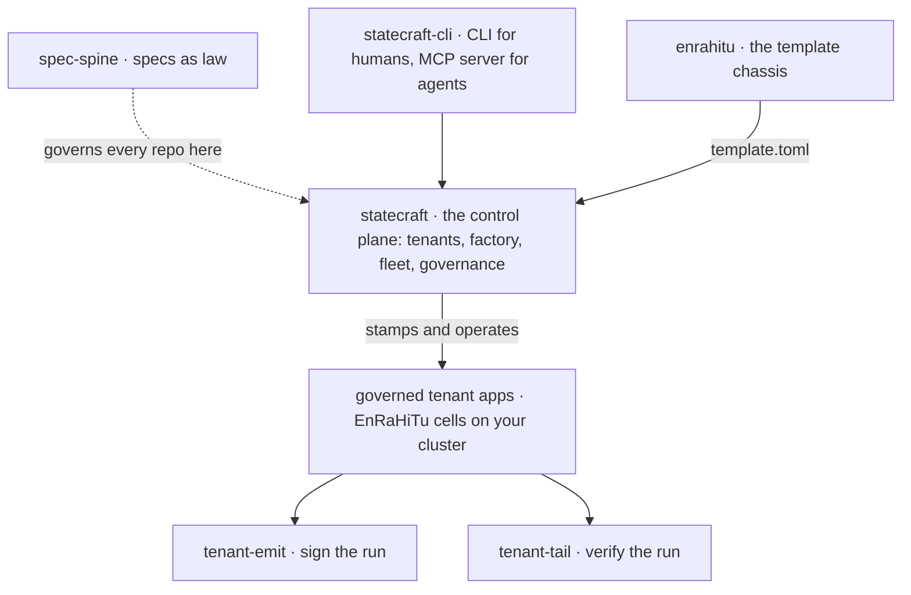

# [statecraft.ing](https://statecraft.ing)    


<div align="center">

### Governed software delivery for the agentic era

**AI can write the code. The unsolved problem is trusting what it wrote.**

We build the machinery that makes machine-generated change *auditable*: <br />
the human authors the contract, agents do the work, and gates (not optimism) refuse a change
that drifts from the spec that authorised it. <br />
Stop reviewing output; start constraining intent.

</div>

---

## The thesis

No human reviews every line an agent writes; pretending otherwise just moves the
bottleneck back to the human. So we move the trust boundary upstream. Intent
becomes a requirement, the requirement becomes a typed spec, and the spec becomes
law: a hash-verifiable contract. Machinery enforces it at pull-request time
today, through `spec-spine couple`; enforcing it at run time is what the
control plane is being built to do.

Agentic output is hostile by default. It earns passage by surviving gates, not by
appealing to trust. Humans gate the contracts (specs, approvals, irreversible
boundaries); everything between them is enforced and recorded by code.
What it is built to produce is independently verifiable evidence: a change
bound to the spec that authorised it, and a run record a third party can
re-check offline without trusting whoever produced it. Evidence records what
a named verifier observed at a named revision. It is not a compliance
verdict, and nothing here decides one for you.

---

## The shape of the family

Statecraft is a two-plane system: the control plane is one EnRaHiTu app, and
every tenant app it stamps is another, independent one.



---

## Start here

Nothing in this block needs an account, a hosted service, or a change of
runtime. spec-spine installs into a repository you already have:

```sh
cargo install spec-spine-cli
spec-spine init      # scaffolds spec-spine.toml, standards/, specs/000-bootstrap
spec-spine compile && spec-spine index && spec-spine lint
```

It is also on npm (`npm i -D spec-spine`, then `npx spec-spine`) and PyPI
(`pip install spec-spine`). Write a spec that claims the files it governs,
run `spec-spine couple` on pull requests, and a change to a claimed file
without an edit to its owning spec is refused. The full walkthrough is
[spec-spine's adoption guide](https://github.com/statecrafting/spec-spine/blob/main/docs/adoption-guide.md).
The repository that renders this page is governed the same way.

---

## Projects

Each entry keeps three facts apart. **Implemented** means the owning specs
in that repository are complete. **Released** means a version you can
install without a source checkout. **Hosted** means a service you can sign
up for, and there is none yet. Implemented is not released, and none of the
three means supported or proven in production. A draft is a proposal and is
named as one. Every repository here has its own spec corpus, and
`spec-spine registry plan` run there is the live answer.

### The platform

#### [statecraft](https://github.com/statecrafting/statecraft)


The governed agentic delivery control plane: tenants (per-customer GitHub App
installations), factory (stamps apps from the enrahitu template via its
versioned `template.toml` contract), fleet (operates the stamped apps on
hetzner-k3s), and the governance UI. It is itself the first production
EnRaHiTu app: the platform is governed by the same machinery it offers.

**Implemented:** the app shell, Postgres adoption, tenants, the factory, the
fleet, the governance web app, the attestation ledger, the admin frontend
and the agent harness (its specs 002 to 008, 012 and 013). Control-plane
deploy, the cluster and tenant lifecycle are in progress (009 to 011).

**Hosted:** no hosted service is open for sign-up. Nothing in **Start here**
needs one.

### The template

#### [enrahitu](https://github.com/statecrafting/enrahitu)


A membership and association management platform that organisations
self-host and extend rather than fork: members, tiers, renewals, dues,
events, volunteers, documents and board governance. One container and one
volume is the whole deployment: typed Encore.ts APIs, rauthy as the
organisation's own identity provider, and hiqlite in-process, with no
managed-infrastructure dependency. **EnRaHiTu** is the stack it began as:
**En**core.ts + **ra**uthy + **hi**qlite + **Tu**rso/libSQL. It began as the
template chassis the Statecraft factory stamps, and the versioned
`template.toml` contract that serves that role is still in progress (its
spec 009).

**Implemented:** the single-container application with its own identity
provider and in-process state, the chassis boundary that leaves `app/` to
the organisation across upgrades, the membership core and application mail
(its specs 002, 005, 007, 035, 036 and 037). The versioned `template.toml`
contract is in progress (009) and board governance is pending (038).

**Released:** no installable artifact this page can point to yet. Its
README and operations guide describe the container.

### The interface

#### [statecraft-cli](https://github.com/statecrafting/statecraft-cli)


The family's local tooling, in one repository. `statecraft` is the CLI for
humans and an MCP server for agents over the same governance verbs, so a
coding agent requests approvals, checks spec-code coupling and drives stages
through the controls a person passes through rather than around them. Since
2026-09-09 the repository is also the monorepo for the family's tooling (its
spec 110): the local run engine, the sensors, the Claude and Codex drivers,
the contract and journal crates and a local React interface live under
`members/` and `crates/`, and `statecraft <member>` dispatches to them.

**Implemented:** the CLI and MCP server, member dispatch, the governed
harness, and the local run floor: candidate worktrees, acceptance receipts,
the action broker and the credential fence (its specs 101 to 125). Receipts
are hash-chained journal records and are not signed (its spec 121).

**Released:** `statecraft` v0.1.0 (July 2026), installed by `install.sh` on
macOS and Linux or from a `.zip` on Windows. Every archive ships a
`.sha256`, a CycloneDX SBOM and a build-provenance attestation. That release
predates the monorepo: it carries the hosted-plane verbs and the MCP server,
not the local engine, drivers or interface. Packaging those for a clean
install is a draft (130).

### The spine

#### [spec-spine](https://github.com/statecrafting/spec-spine)


[](https://crates.io/crates/spec-spine-cli)
[](https://www.npmjs.com/package/spec-spine)

The foundation everything else is built on: a typed, hash-verifiable authority
ledger over a markdown spec corpus. Each spec declares, in YAML frontmatter, the
files, sections, symbols, and crates it owns; a PR-time coupling gate refuses code
that drifts from its owning spec. Every artifact is a pure function of (config,
file contents): byte-identical output on every platform. Installable from
crates.io, npm, or PyPI. It governs itself, its own coupling gate runs against its
own spec corpus in CI.

It stands alone: it governs repositories that use nothing else in this
family, and it needs no account and no server. Every other repository on
this page carries its own spec corpus and runs its coupling gate in CI,
except the three primitives noted below.

**Released:** 0.18.0 on crates.io (`spec-spine-cli`), npm and PyPI, with
prebuilt binaries on its GitHub releases. A corpus attestation can be sealed
with an Ed25519 key you hold (`spec-spine attest --sign`, its spec 023); a
valid seal says that key signed those bytes, not that the key is trusted or
the corpus correct.

### The tenant toolkit

#### [tenant-emit](https://github.com/statecrafting/tenant-emit)


An emit-only CLI a stamped application pins to build a signed
`governance-certificate.json` from a finished run directory: scan every stage,
SHA-256 every artifact, lift the frozen spec hash, attach an attributable
signer, and write a self-authenticating certificate. Identity-bearing and offline.

#### [tenant-tail](https://github.com/statecrafting/tenant-tail)


The verify-only counterpart: a CLI a stamped application pins to re-check the
factory's run-side paperwork (artifact-hash chain, Ed25519 signature, platform
countersign, inter-stage manifest chain) with zero trust in the producer. Offline,
identity-free, read-only all the way down. *Spine to tail to emit:* spec-spine
compiles the corpus, tenant-tail verifies the run-side paperwork, tenant-emit
produces it.

**Released:** `tenant-emit` and `tenant-tail` on npm and PyPI, and as
binaries on each repository's GitHub releases.

### The primitives

Rust libraries, all released on crates.io: `trust-window` and
`canonical-keysort-json` under those names, `action-gate` as
`action-gate-core` and `action-gate-types`, and `attest-ledger` as
`attest-ledger-core`, `attest-ledger-types` and `attest-ledger-cli`.
`action-gate`, `attest-ledger` and `trust-window` each carry only a
draft bootstrap spec and run no coupling gate yet; `canonical-keysort-json`
is governed like the rest of the family.

#### [action-gate](https://github.com/statecrafting/action-gate)


A pure, deterministic decision gate over a pluggable Check registry:
`evaluate(context, checks)` returns Allow, Deny, or Degrade, with a stable
config hash so the policy that decided is itself attestable.

#### [attest-ledger](https://github.com/statecrafting/attest-ledger)


A tamper-evident record ledger library: append-only and hash-linked, with
an Ed25519-signed genesis anchor and an independent verifier that does not
trust its producer.

#### [trust-window](https://github.com/statecrafting/trust-window)


A rolling-window trust scorer: weighted samples map to a graduated privilege
level, degrade-only or bidirectional, deterministic and snapshot-persistable.

#### [canonical-keysort-json](https://github.com/statecrafting/canonical-keysort-json)


Deterministic canonical JSON: a lexicographic key sort at the serialization
boundary, so record hashes agree everywhere.

### The packages

#### [statecrafting](https://github.com/statecrafting/statecrafting)


The shared native packages behind the family: the `@statecrafting/*` napi-rs
addons (hiqlite, kernel, governance, fleet) and the vendored Encore build
toolchain that statecraft and enrahitu consume. Three licenses coexist here,
each declared in the package's own manifest and `LICENSE` file:
`@statecrafting/toolchain`, `kernel-native` and `hiqlite-native` are
Apache-2.0; `governance-native` and `fleet-native` are AGPL-3.0; and the
three `@statecrafting/toolchain-<platform>` packages, which carry the
vendored Encore build toolchain, are MPL-2.0.

**Released:** every package is published on npm under `@statecrafting/*`.

---

## Why these licenses

Each license below is the one declared in that repository's `LICENSE` file
or, in `statecrafting`, in each package's own manifest. What each requires:

- **AGPL-3.0**: `statecraft`, and the `governance-native` and `fleet-native`
  packages. Running it carries no condition. Distributing it, or offering a
  modified version to users over a network, requires making the
  corresponding source available to them under the same license.
- **Apache-2.0**: the template, the CLI, the spine, the tenant toolkit, the
  primitives, and the `toolchain`, `kernel-native` and `hiqlite-native`
  packages. Redistribution keeps the license text and notices and marks the
  files that were changed.
- **MPL-2.0**: the three `@statecrafting/toolchain-<platform>` packages.
  Distributing them requires making the source of those MPL-covered files
  available under MPL-2.0, including any changes to them; other code in the
  same application keeps its own license.

The split is deliberate: the control plane carries the network-use
condition, and the building blocks an application consumes do not. This
section summarises license terms. It is not legal advice, and no license
here is a warranty.

---

<div align="center">

Built in the open from Edmonton, Canada by [**@bartekus**](https://github.com/bartekus)
and a fleet of governed agents, which is rather the point.

**[statecraft.ing](https://statecraft.ing)** · **[bartekus.com](https://bartekus.com)** · **[the control plane ↗](https://github.com/statecrafting/statecraft)**

</div>
