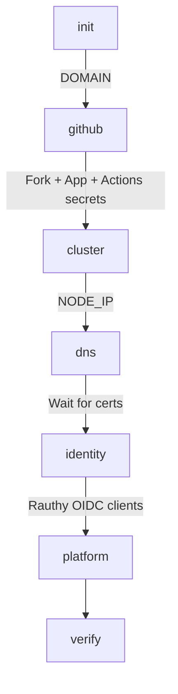

# Phase Model

`oap-bootstrap` orchestrates the deployment process through a strict, linear dependency graph. Rather than maintaining a stateful database, the CLI uses a phase-structured approach where the `oap.env` configuration file serves as the sole resumable state.

## The Dependency Graph

The provisioning sequence executes in a specific order, where each phase relies on the outputs of the preceding ones.

1. **`init`**: Collects user input, generates random secrets, and derives URLs based on the target domain.
2. **`github`**: Forks the upstream repository, registers the GitHub App via the manifest flow, and configures Actions secrets. This phase occurs before cluster creation because the GitHub App's webhook and OAuth callback URLs are deterministically computed from the domain.
3. **`cluster`**: Wraps the upstream `setup.sh` Phase 1 script to provision the K3s cluster and bootstrap Flux. It captures the worker node's external IP address (`NODE_IP`).
4. **`dns`**: Creates Cloudflare A records pointing to the `NODE_IP` and waits for cert-manager to issue the necessary TLS certificates.
5. **`identity`**: Connects to the live Rauthy instance to create the required OIDC clients and register the GitHub upstream provider.
6. **`platform`**: Wraps `setup.sh` Phase 2, passing in the full set of provider-produced keys to materialize secrets and deploy the workloads.
7. **`verify`**: Asserts that all public endpoints are healthy and reachable.

## Idempotency and Resumability

Every phase is designed to be idempotent. The CLI employs a "detect-or-create" strategy against both the `oap.env` file and the live cloud or cluster state. 

If a phase produces a value (such as a generated secret or a provider-issued credential), it immediately writes that value back to `oap.env`. This ensures that if the process crashes after a resource is created, the resource's identity is not orphaned.

Because of this design, "resuming" a failed deployment simply means re-running the phase that failed. The CLI will read the accumulated state from `oap.env`, skip the steps that have already completed, and pick up exactly where it left off. A second run of the entire sequence against a fully provisioned instance will perform no cloud mutations and exit cleanly.
