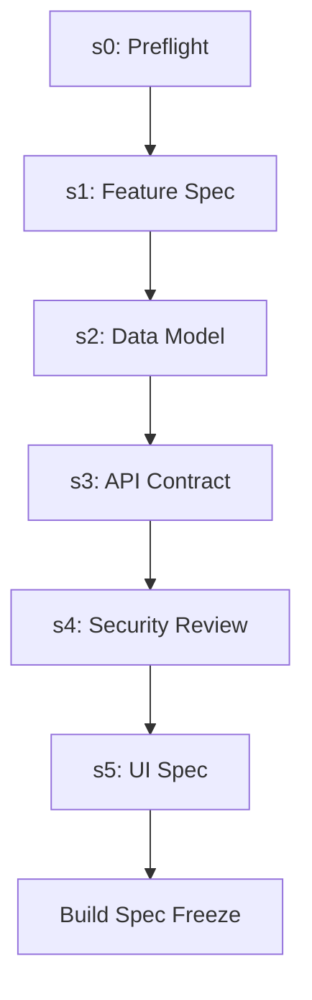
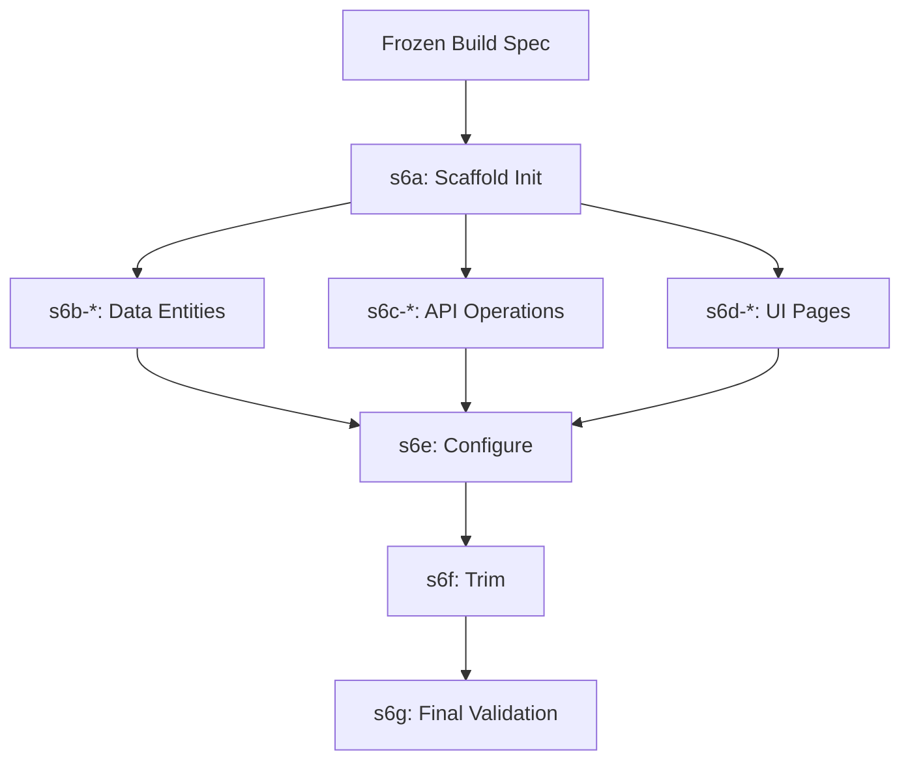

# Factory Pipeline

The Factory Pipeline is the built-in orchestration engine that translates high-level business documents into scaffolded, verifiable code. It operates in two distinct phases: sequential planning and dynamic fan-out generation.

## Phase 1: Planning (s0 through s5)

Phase 1 is a sequential, agent-driven process that analyzes requirements and builds a comprehensive plan.

- **s0-preflight**: Validates the input business documents.
- **s1-feature-spec**: Extracts core features and user journeys.
- **s2-data-model**: Designs the database schema.
- **s3-api-contract**: Defines the API endpoints and payloads.
- **s4-security**: Reviews the design against policy constraints.
- **s5-ui-spec**: Specifies the frontend pages and components.

After `s5` is approved, the output is hashed and frozen into the **Build Spec**. This frozen artifact becomes the immutable input for Phase 2.

## Phase 2: Scaffolding (s6a through s6g)

Phase 2 takes the frozen Build Spec and fans out to generate the actual codebase against a pluggable adapter.

- **s6a**: Copies the adapter base, installs dependencies, and verifies compilation.
- **s6b-s6d**: Dynamic fan-out steps. The orchestrator spawns parallel tasks for each data entity, API operation, and UI page defined in the Build Spec.
- **s6e**: Wires authentication, environment variables, and deployment config.
- **s6f**: Removes unused placeholder files from the template.
- **s6g**: Runs full build, test, lint, and type-check commands.

Each step in Phase 2 includes post-verification commands (e.g., compile, test). If a step fails, the orchestrator rebuilds the prompt with the `stderr` output and retries up to three times.

At the successful completion of Phase 2, the system emits the Governance Certificate.
