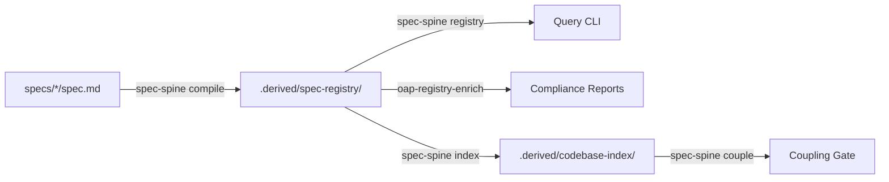

# Spec Spine Toolchain

The Spec Spine toolchain is the engine that converts human intent into machine-enforceable governance. It consists of an external, published compiler and a suite of repository-specific overlay tools.

## The External Engine

Crucially, the core spec engine is **not vendored** within the OAP repository. It is a published, Apache-2.0 licensed project maintained in its own repository (`statecrafting/spec-spine`).

The engine ships as the `spec-spine-cli` crate on crates.io. OAP pins a specific version (e.g., `0.10.0`) and installs it globally during the `make setup` process.

This separation ensures that the core compilation logic remains generic and portable, while OAP focuses on platform-specific rules.

## The Toolchain Workflow

### 1. Compiler (`spec-spine compile`)
Reads the Markdown specs, parses the YAML frontmatter, resolves the relationship graph, and emits deterministic JSON shards into `.derived/spec-registry/by-spec/`.

### 2. Registry Queries (`spec-spine registry`)
A typed read-only CLI that provides governed access to the compiled registry. It supports subcommands like `list`, `show`, `status-report`, and `show-relationships`.

### 3. Codebase Indexer (`spec-spine index`)
Scans the repository, reads manifest files (like `Cargo.toml` or `package.json`), and maps every code unit back to its governing spec. The output is rendered into `.derived/codebase-index/CODEBASE-INDEX.md`.

### 4. Coupling Gate (`spec-spine couple`)
Analyzes Git diffs against the codebase index and relationship graph to ensure that code changes are accompanied by corresponding spec updates.

## OAP Overlay Tools

While the core engine is external, OAP maintains specific overlay tools in the `tools/oap/` and `tools/spec-spine/` directories:

- **`spec-lint`**: Enforces OAP-specific authoring rules (e.g., V-020 for relationship graph well-formedness).
- **`oap-registry-enrich`**: Generates OAP-specific artifacts, such as the OWASP ASI 2026 compliance report.
- **`oap-code-index-enrich`**: Adds platform-specific metadata to the codebase index.
