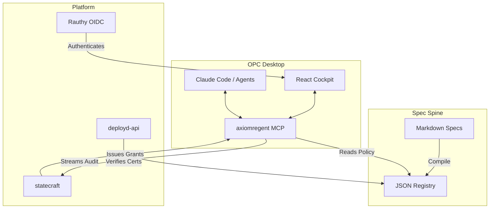

# Three-Layer Overview

The Open Agentic Platform is architected around three distinct but interlocking layers. This design ensures that governance is not just a policy, but a structural reality enforced at every stage of the software lifecycle.

## The Three Layers

1. **The Spec Spine**: The foundation of truth. It consists of human-authored Markdown specifications that compile into a machine-readable JSON registry.
2. **The Platform (Control Plane)**: The service layer that provides identity, orchestration, and audit capabilities.
3. **The OPC Desktop**: The local execution environment where agents and humans collaborate.

## How They Keep Each Other Honest

The strength of OAP lies in how these layers interact and constrain one another.

1. **Spine constrains OPC**: The `axiomregent` MCP server running in the desktop reads policy bundles derived from the Spec Spine. An agent cannot execute a tool if the spec-derived policy forbids it.
2. **Platform audits OPC**: Every action taken by an agent through the MCP server is streamed to the `statecraft` SaaS audit log. The platform maintains an immutable record of what happened locally.
3. **Spine constrains Platform**: The `deployd-api` will not orchestrate a deployment unless the artifacts are accompanied by a valid Governance Certificate, which itself is tied back to the processes defined in the Spec Spine.
4. **Platform empowers OPC**: The `statecraft` service issues project-scoped grants and identity tokens that the OPC desktop uses to authorize agent sessions.

This tripartite architecture ensures that no single component can unilaterally bypass governance. The rules are written in the Spine, executed in the OPC, and verified by the Platform.
